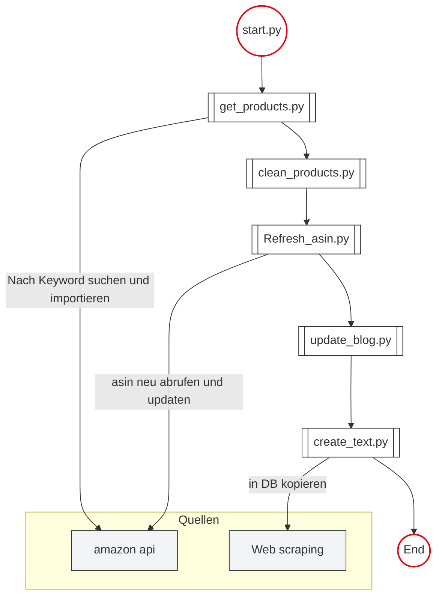

# warum?
test content

tut ihr mir das an?

## unterthema

aaaaaaa

# Linux
## überschift

```python
print("test")
```

### Mermaid code



# Umgebungsvariablen in Docker

dsoijdsjd

## unterthema

# in Docker compose
mehr text