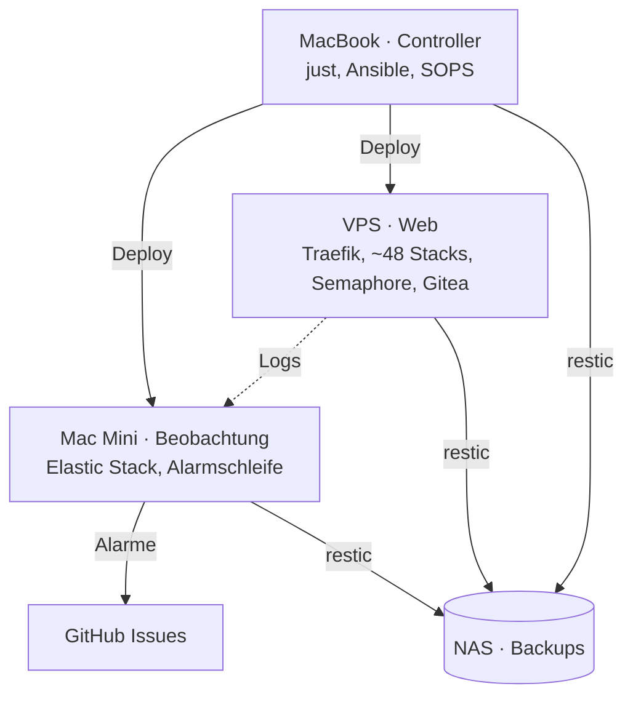
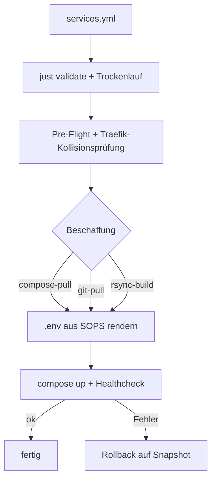
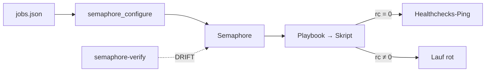
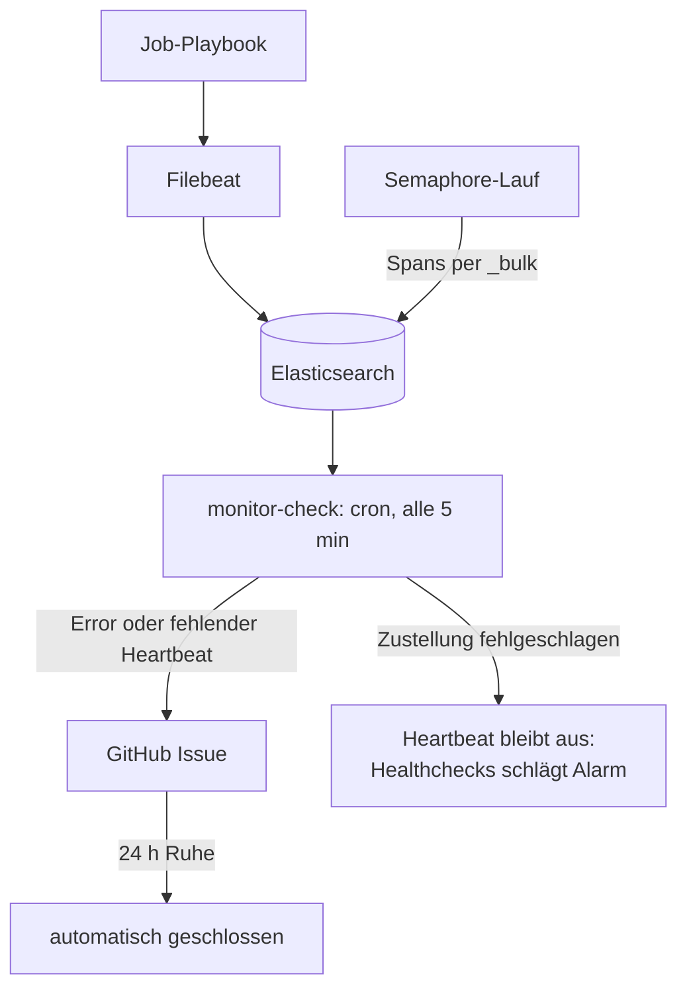
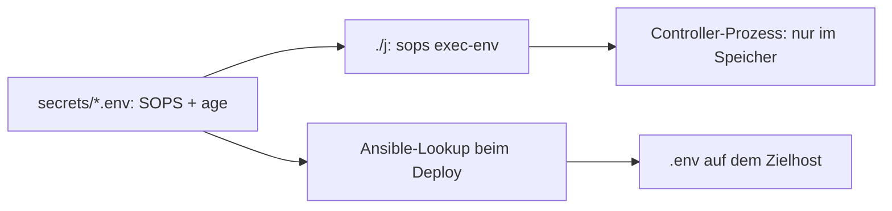

Mein Homelab besteht aus einem MacBook, einem Mac Mini, einem VPS und einem NAS.
Bis Juli 2026 lagen Dienste, Cronjobs, Skripte und Zugangsdaten verstreut auf
diesen Maschinen – was wo läuft, wusste nur die Maschine selbst. Seit dem
ersten Commit am 23. Juli 2026 beschreibt **ein** Repo das Ganze und betreibt
es auch: Deploys, geplante Jobs, Überwachung, Alarme und Backups.

Dieser Artikel zeigt nicht das Repo Datei für Datei, sondern welche Technologie
wofür zuständig ist und wie die Teile zusammenspielen.

## Hosts und Rollen

Jede Maschine hat genau eine Rolle. Verbunden sind alle über
[Tailscale](https://tailscale.com) – SSH, Verwaltungsoberflächen und interne
Dienste sind nur im eigenen Tailnet erreichbar.



| Host     | Rolle                                                                         |
| -------- | ----------------------------------------------------------------------------- |
| MacBook  | Controller: Ansible und Deploys laufen von hier, dazu CI-Runner für iOS-Builds |
| Mac Mini | Immer an: Elastic Stack, Alarmschleife, interne Dienste unter eigener Zone    |
| VPS      | Web-Hosting: rund 48 Docker-Compose-Stacks hinter Traefik, Semaphore, Gitea   |
| NAS      | Ziel der nächtlichen Backups aller drei Hosts                                 |

## Welche Technologie wofür

| Schicht           | Technologie                       | Wofür                                                                |
| ----------------- | --------------------------------- | -------------------------------------------------------------------- |
| Bedienung         | `just`                            | rund 70 Rezepte in Gruppen (check, run, setup, release) als einzige Oberfläche |
| Konfiguration     | Ansible                           | Deploy-Rolle, Job-, Check- und Runbook-Playbooks, eigenes Callback-Plugin |
| Laufzeit          | Docker Compose                    | jeder Dienst ist ein Compose-Stack, ein Repo je Dienst (Git-Submodule) |
| Eingang           | Traefik                           | Reverse Proxy und TLS über Let's Encrypt; auf dem Mini mit CoreDNS     |
| Netz              | Tailscale                         | SSH, Split-DNS, Verwaltungsoberflächen nur im Tailnet                |
| Planung           | Semaphore UI                      | einziger Scheduler für alle Runbooks                                 |
| Logs              | Elasticsearch, Filebeat, Kibana   | ein Log-Index für Dienste, Jobs und Ansible-Läufe                    |
| Alarme            | GitHub Issues                     | einziger Alarmkanal, mit Dedup und automatischem Schließen           |
| Lebenszeichen     | Healthchecks, Checkmk             | Dead Man's Switch je Job; Host-, Container- und Runbook-Überwachung  |
| Secrets           | SOPS + age, gitleaks              | verschlüsselt im Repo; Pre-commit-Scan gegen Klartext-Geheimnisse    |
| Backups           | restic, `sqlite3 .backup`, pg_dump | Hosts aufs NAS, Datenbanken täglich mit Integritätsprüfung          |
| Code und CI       | Gitea                             | selbst gehostetes Git mit eigenem Runner                             |
| Qualität          | uv, Python, ansible-lint          | Skripte als `uv run --script`, über 300 Unit-Tests, Lint-Gate        |
| Doku              | BPMN                              | Prozessmodelle der wichtigsten Abläufe, automatisch gelayoutet       |
| Später            | Terraform                         | Gerüst für DNS und VPS, noch ohne Ressourcen                         |

## Grobe Struktur

```
ansible/                Inventory, Playbooks, Deploy-Rolle, Plugins
<host>-services/        Dienste als Submodule: <host>-services/<state>/<name>
services.yml            Deklaration aller Dienste + JSON-Schema
monitoring/             Elastic, Filebeat, Alarm-Skripte, jobs.json
semaphore/, gitea/      eigene Infrastruktur-Dienste
secrets/                verschlüsselte dotenv-Dateien (SOPS)
scripts/                Submodule, Validator, Secrets-Helper, Berichte
terraform/              Gerüst
```

Host und Zustand eines Dienstes stehen **nur im Pfad**: Ein Dienst unter
`<host>-services/inactive/` ist abgeschaltet, ein Verschieben nach `active/`
schaltet ihn ein. `services.yml` ergänzt nur Details wie Domain, Port oder
Deploy-Muster – widerspricht es dem Pfad, gewinnt der Pfad und `just status`
zeigt die Abweichung rot.

## Ein Einstiegspunkt für jeden Deploy

Jeder Deploy läuft über denselben Befehl und dieselbe Ansible-Rolle. Verzweigt
wird nur an einer Stelle: wie der Code auf das Ziel kommt.



- **compose-pull** überträgt nur die deklarierten Dateien, das Image kommt aus
  der Registry.
- **git-pull** lässt das Ziel selbst klonen – und lehnt ab, wenn dort
  uncommittete Änderungen oder ungepushte Commits liegen.
- **rsync-build** schiebt den lokalen Stand und baut auf dem Ziel; die
  `.gitignore` des Dienstes wird zur Ausschlussliste.

Alles danach ist für alle Muster gleich. Ein viertes Muster wäre ein weiteres
Task-File in der Rolle, kein zweites Playbook. Der Validator fängt vorher, was
sonst erst beim Deploy auffällt: doppelte Domains, ein Traefik-Dienst mit
offenem Port oder ein `git-pull` ohne Repo.

## Geplante Jobs: genau ein Scheduler

Anfangs startete eine Crontab auf dem MacBook die Jobs. Nach zwei Pannen –
Jobs liefen wegen der Zeitzone zwei Stunden zu spät, und einige waren in cron
**und** Semaphore doppelt geplant – gilt: Jeder Job hat genau einen Scheduler,
und das ist [Semaphore UI](https://semaphoreui.com).



Die Jobs stehen als Daten in `jobs.json`; ein Skript gleicht Semaphore daran
an, ein zweites meldet jede Abweichung. Lokal läuft derselbe Job mit
`just job <id>`.

## Alarme: eine Kette, die ihr eigenes Versagen meldet



Ein Ansible-Callback schreibt für jeden Task einen Span nach Elasticsearch;
über eine `trace_id` hängen alle Tasks eines Laufs zusammen. Die Alarmschleife
läuft bewusst per cron auf dem Mac Mini und **nicht** in Semaphore – sie darf
nicht von dem Scheduler abhängen, den sie überwacht.

Der Anlass für die Selbstüberwachung: Drei Tage lang bekam die Schleife beim
Anlegen von Issues nur HTTP 401 zurück – in mehr als der Hälfte aller Läufe,
ohne dass ein einziges Issue entstand. Seitdem endet das Skript mit Fehler,
wenn ein Alarm nicht zugestellt wird, und der Heartbeat bleibt aus.

## Secrets: verschlüsselt im Repo



Zugangsdaten liegen mit [SOPS](https://github.com/getsops/sops) und age
verschlüsselt im Repo; entschlüsseln können nur die beiden Macs. `./j` ist
`just` mit entschlüsselter Umgebung – geladen in genau einen Prozessbaum, nie
auf die Platte geschrieben. Beim Deploy liest ein Lookup die Werte im Speicher
und rendert die `.env` erst auf dem Ziel. Ein fehlender Schlüssel ist ein
harter Fehler, kein leerer Wert. gitleaks prüft vor jedem Commit, dass nichts im
Klartext durchrutscht.

## Zeitleiste

| Zeitraum      | Phase                                                                                   |
| ------------- | --------------------------------------------------------------------------------------- |
| 23.–25.07.    | Fundament: Monitoring, Ansible-Callback, erste Jobs, Semaphore und Gitea auf dem VPS     |
| 26.–28.07.    | Ein Deploy-Pfad (`services.yml` + Rolle), Submodule-Layout, Lint- und Test-Gate         |
| 27.–30.07.    | Gegen „falsches Grün“: Alarmkette repariert, Wächter für den Wächter, alles in Semaphore |
| 30.07.–04.08. | Härtung: Vertragsregeln im Validator, Firewall deklariert, besseres Rollback            |
| 06.–09.08.    | SOPS + age; der Mac Mini wird Beobachtungs-Host, interne Dienste nur noch im Tailnet    |
| 16.08.–01.09. | Betriebsreife: Checkmk, Backup-Kette aufs NAS, BPMN-Prozessmodelle                     |

## Was ich daraus mitnehme

- **Ein grüner Status ist eine Behauptung.** `ignore_errors` hielt die
  Ansible-Zusammenfassung auf `failed=0`, obwohl Skripte scheiterten. Jedes
  Job-Playbook endet deshalb mit `fail:` auf dem Exit-Code des Skripts, und der
  Erfolgs-Ping hängt am Skript, nicht am Playbook. Tests erzwingen beides.
- **Eine Quelle je Fakt.** Host und Zustand stehen im Pfad, Jobs in
  `jobs.json`, Dienste in `services.yml` – alles andere wird daraus abgeleitet
  und auf Abweichung geprüft.
- **Ein Einstiegspunkt, verzweigt wird innen.** Ein Deploy-Befehl, ein
  Scheduler, ein Alarmkanal.
- **Werkzeuge überschreiben keine Arbeit.** Synchronisieren und Deployen
  brechen ab, wenn am Ziel fremde Änderungen liegen, und nennen sie.
