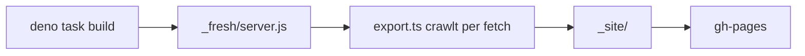

Diese Seite lief seit 2022 mit Jekyll und dem Chirpy-Theme. Seit Oktober 2026
ist sie eine [Fresh](https://fresh.deno.dev)-App – ausgeliefert wird aber
weiterhin reines HTML über GitHub Pages. Hier die wichtigsten Bausteine.

## Der Stack

- **Deno Fresh 2** mit Vite 7 und Preact 10
- **Tailwind CSS 4** plus `@tailwindcss/typography` für die Posts
- **Islands** nur dort, wo es wirklich interaktiv wird: Startseite, JSON
  Formatter, Regex Tester, Mermaid-Diagramme

Formatieren, Linten und Typprüfung erledigt Deno selbst:

```sh
deno task check   # deno fmt --check && deno lint && deno check
```

## Statischer Export statt Server

GitHub Pages kann keinen Server ausführen. Deshalb startet
`scripts/export.ts` den gebauten Fresh-Server im selben Prozess, ruft ihn per
`fetch()` ab `/` auf und folgt allen internen Links. Jede Antwort landet als
Datei in `_site/`:



Dabei prüft der Export gleich mit und bricht ab, wenn

- ein interner Link nicht mit 200 antwortet,
- eine URL der alten Seite fehlt (Liste in `scripts/legacy-urls.txt`),
- eine Datei aus `static/` nicht byte-identisch im Export liegt,
- die 404-Seite nicht mit Status 404 antwortet.

## Alte URLs bleiben erreichbar

- Die Support- und Datenschutzseiten der iOS-Apps liegen unverändert in
  `static/` – App Store Connect verlinkt genau diese Dateien.
- `/archives/` und `/categories/…` leiten per Meta-Refresh auf `/posts` und
  `/tags/…` weiter.
- Chirpy hatte einen Service Worker registriert. Ein neues `/sw.js` löscht
  dessen Caches und meldet ihn ab, damit niemand dauerhaft die alte Seite sieht.

## Deploy

Die GitHub Action führt `check`, `build` und `export` aus und schiebt `_site/`
mit `peaceiris/actions-gh-pages` in den Branch `gh-pages`. Pull Requests werden
nur gebaut und geprüft.
