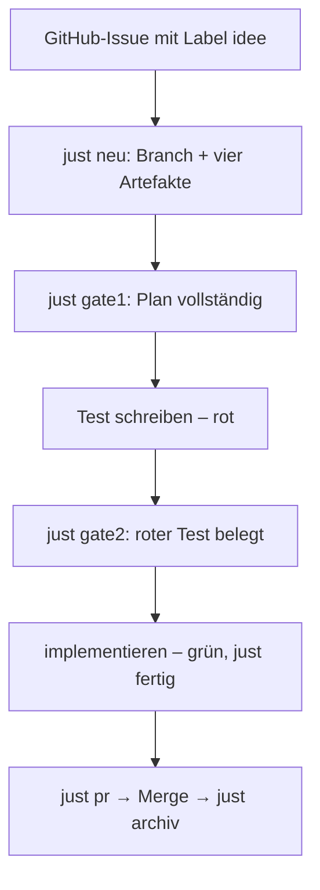

Meine Aufgaben lagen in den letzten Monaten an drei Orten. Jeder Wechsel kam,
weil ein Coding-Agent mehr von der Arbeit übernommen hat – und die Aufgabe
dorthin musste, wo der Agent sie lesen und abschließen kann.

## Station 1: TickTick

Eine klassische To-do-App: schnell erfasst, auf allen Geräten da. Für einen
Agenten aber eine Blackbox – Aufgaben und Code lebten getrennt, und jede
erledigte Aufgabe musste ich von Hand abhaken.

| Vorteile                          | Nachteile                                   |
| --------------------------------- | ------------------------------------------- |
| Schnell erfasst, auf allen Geräten | Liegt außerhalb der Repos                   |
| Erinnerungen, Kalender, Listen    | Agent kann Aufgaben weder lesen noch schließen |
| Keine Einrichtung je Projekt      | Kein Bezug zu Branch, Commit oder PR        |

## Station 2: beads

[beads](https://github.com/gastownhall/beads) (`bd`) legt die Aufgaben neben den
Code ins Repo. Der Agent legt Tasks an, verknüpft Blocker
(`bd dep add <blockiert> <blocker>`) und schließt sie selbst
(`bd close <id>`).

In der Praxis kostete das mehr, als es brachte: ein eigenes Werkzeug mit eigener
Datenbank, das in jedem Repo eingerichtet und gepflegt werden will, und
regelmäßig Probleme, die nichts mit der eigentlichen Arbeit zu tun hatten.
Dazu kommt die Sichtbarkeit: Ohne eigene Skripte sind die Aufgaben schwer
einzusehen. Von außen kommt man nur über die GitHub-Content-API an die Dateien
im Repo – möglich, aber mit Extra-Aufwand. Und bei mehreren Worktrees war nie
ganz klar, welcher Stand gerade gilt.

Einen großen Mehrwert gegenüber Issues habe ich am Ende nicht gefunden.

| Vorteile                          | Nachteile                                        |
| --------------------------------- | ------------------------------------------------ |
| Aufgaben liegen im Repo beim Code | Zusätzliches Tool je Repo, extra Overhead        |
| Agent legt an und schließt selbst | Häufige Probleme mit dem Werkzeug selbst         |
| Abhängigkeiten zwischen Tasks     | Ohne eigene Skripte schwer einsehbar             |
|                                   | Abruf von außen nur über die Content-API         |
|                                   | Unklarer Stand bei mehreren Worktrees            |
|                                   | Zweite Liste neben den GitHub-Issues             |

## Station 3: GitHub-Issues mit OpenSpec-Change

Heute gibt es genau einen Ideenspeicher: GitHub-Issues. Sie sind in jedem Repo
schon da, brauchen keine Einrichtung, werden in GitHub sauber angezeigt und sind
über die API von überall abrufbar. Jedes Werkzeug – vom Agenten über die
`gh`-CLI bis zur App auf dem Handy – kann sie lesen und schreiben. Und weil sie
nicht im Branch liegen, sehen alle Worktrees denselben Stand.

Ein Issue mit dem Label `idee` ist ein künftiges Vorhaben. Es wird erst zur
Arbeit, wenn daraus ein
[OpenSpec](https://github.com/Fission-AI/OpenSpec)-Change wird – mit eigenem
Branch, eigenem Arbeitsbaum und einem Pull Request gegen `main`.

Die Gates sind Befehle mit Exit-Code, keine Bestätigungen. Gate 1 hält, wenn im
Plan Testdateien fehlen. Gate 2 hält, wenn der Test nicht rot ist. Ohne
bestandenen Abschluss verweigert `just pr` den Push. Jede Gate-Regel ist eine
reine Funktion mit eigenem Test – ein Gate, das sich nicht prüfen lässt, wäre
nur eine Behauptung.

Zwei Changes laufen nur parallel, wenn sich die Dateien, die sie laut
`proposal.md` anfassen, nicht überschneiden.

| Vorteile                                     | Nachteile                                    |
| -------------------------------------------- | -------------------------------------------- |
| Nativ in jedem Repo, keine Einrichtung       | Braucht GitHub (bzw. eine Forge) und Netz    |
| Sauber in GitHub sichtbar, per API abrufbar  | Kein schnelles Erfassen privater To-dos      |
| Ein Stand für alle Worktrees                 |                                              |
| Issue → Change → PR → Merge hängt zusammen   | OpenSpec-Artefakte kosten pro Change Aufwand |
| Gates erzwingen Plan und roten Test          | Gates prüfen nicht, ob der Test das Richtige prüft |

## Was sich geändert hat

| Station          | Wo die Aufgabe lebt | Wer sie abschließt             |
| ---------------- | ------------------- | ------------------------------ |
| TickTick         | App                 | ich                            |
| beads            | Repo, eigenes Tool  | Agent (`bd close`)             |
| Issue + OpenSpec | GitHub + Branch     | Agent, aber nur über die Gates |

## Fazit

Das einfachere, überall vorhandene Werkzeug hat gewonnen. Issues können weniger
als beads, aber sie sind schon da – und was ihnen fehlt, ergänzt der
OpenSpec-Change samt Gates genau an der Stelle, an der Arbeit entsteht.
