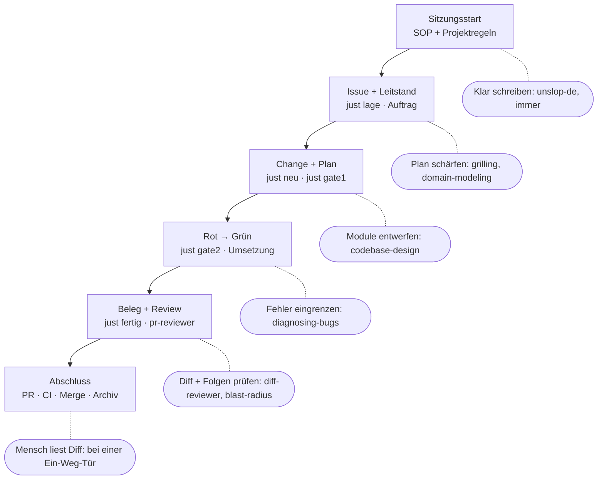

Stand: 4. Oktober 2026. Dieser Artikel ist die Lesefassung des Plugin-Pakets von [ops-lab](/projekte/ops-lab), keine zweite Quelle für Laufzeitregeln. Die gepflegte SOP liegt in `plugins/ops-lab/skills/session-start/SKILL.md`; die Schreibregeln liegen daneben in `skills/unslop-de/SKILL.md`.

## Orientierung

Ein aktives Plugin liefert beim Sitzungsstart die gemeinsame SOP und unslop-de. Die lokale CLAUDE.md enthält die projektspezifischen Regeln. Ein Issue wird durch einen eigenen Change, Branch und Worktree umgesetzt. Der Leitstand koordiniert Arbeiter und frischen Reviewer; Gate-Werkzeuge prüfen Plan, roten Test und Abschluss. Erforderliche Zusatz-Skills werden passend zur Aufgabe geladen.



## Aktuelle Plugin-Auswahl

Der Marketplace heißt `ops-lab-plugin`, das Hauptplugin `ops-lab`. Eine Installation des Hauptplugins bringt die vier Abhängigkeiten pocock, opensrc, pstack und ponytail-review mit. Insgesamt sind 22 Skills und zwei Agenten enthalten. Skills-Sync aus dem älteren Katalog ist kein Skill dieses Plugin-Pakets.

| Plugin | Enthaltene Skills | Quelle | Stand |
|---|---|---|---|
| ops-lab | `diff-reviewer`, `leitstand`, `prozessschmiede`, `session-start`, `unslop-de` | privates Org-Repo | `Marketplace-Hauptbranch` |
| pocock | `tdd`, `domain-modeling`, `grilling`, `grill-me`, `diagnosing-bugs`, `wizard`, `codebase-design`, `grill-with-docs`, `handoff` | mattpocock/skills | `d81f3a183412` |
| opensrc | `opensrc` | vercel-labs/opensrc | `b51de60867e8` |
| pstack | `unslop`, `blast-radius`, `benchmark-checklist`, `technical-writing`, `principle-explain-the-number`, `principle-prove-it-works` | cursor/plugins | `23e4138daa01` |
| ponytail-review | `ponytail-review` | DietrichGebert/ponytail | `c982cd411abb` |

### Konfiguration und Aktivierung

Eine frische Installation in einem getrennten Claude-Konfigurationsverzeichnis hat alle vier Abhängigkeiten automatisch installiert. Die Komponentenliste bestätigt die Skills und den SessionStart-Hook; pstack und ponytail-review haben keine Hooks. Diese Prüfung verändert keine bestehende persönliche Plugin-Konfiguration.

```bash
claude plugin marketplace add <org>/ops-lab-plugin
claude plugin install ops-lab@ops-lab-plugin
```

Diese Befehle beziehen den Hauptbranch des (privaten) Org-Marketplace. Für denselben Standard in anderen Repos muss das Plugin dort aktiv sein; andere Maschinen und Cloud-Sitzungen benötigen denselben Installations- bzw. Verwaltungsweg. Für Codex gibt es bislang keinen entsprechenden SOP-Ladeweg.

`i-have-adhd` bleibt ein separat aktiviertes persönliches Plugin. unslop-de ersetzt es allein nicht: ADHD formt Orientierung und nächste Schritte; unslop-de verbessert die Formulierungen. Die SOP enthält bereits die passenden Kommunikationsregeln. Die bestehende ADHD-Konfiguration wurde nicht deaktiviert.

### Agenten und Hooks

| Bestandteil | Aufgabe und Anlass |
|---|---|
| `ops-lab:change-arbeiter` | Vom Leitstand beauftragt: genau ein Change bis zum committeten Abschluss im eigenen Worktree, ohne Push oder PR. |
| `ops-lab:pr-reviewer` | Vom Leitstand danach in frischem Kontext beauftragt: Spec und Standards getrennt prüfen, belegte Befunde nachbessern. |
| `SessionStart` | Lädt gemeinsame SOP und unslop-de bei Start und Wiederaufnahme, einschließlich Clear/Compact; unabhängig vom Gate-Repo. |
| `PreToolUse` für Bash | Prüft die Ablaufgrenze vor relevanten Push-/PR-Befehlen, wenn das Repo den Ablauf führt. |
| `Stop` / `SubagentStop` | Erinnert im eingerichteten Ablauf an den nächsten offenen Schritt. |

Der Plugin-Ablauf-Hook schweigt bei Repos ohne `tools/gate.projekt.json` und bei Repos mit eigenem `tools/hook.mjs`; dort läuft die lokale Fassung. Von ponytail kommen keine Hooks. Der Start-Hook führt keine Installation aus und verändert keine Projektdateien.

## Vollständige aktuelle SOP

Die folgende Fassung wird unverändert aus der gepflegten SKILL.md übernommen, ohne deren Frontmatter.


### Gemeinsame SOP

Diese SOP gilt in jedem Repo mit aktivem ops-lab-Plugin und wird bei SessionStart geladen, auch nach Resume, Clear und Compact. Lesen Sie vor der ersten Arbeit die projektspezifische CLAUDE.md und zutreffende lokale Rules. Nutzerauftrag und uebergeordnete Anweisungen haben Vorrang; diese SOP erteilt keine zusaetzlichen Schreib-, Push- oder Merge-Rechte.

#### Kommunikation und Arbeit

Fuehren Sie den autorisierten Auftrag bis zum pruefbaren Ergebnis durch. Fragen Sie nur nach Informationen oder Freigaben, die wirklich fehlen; nutzen Sie vorhandene Antworten weiter. Beginnen Sie mit Ergebnis oder naechstem Handgriff, nummerieren Sie auszufuehrende Schritte und berichten Sie bei laengerer Arbeit knapp den aktuellen Stand. Halten Sie Nebenfragen aus dem laufenden Auftrag heraus. Nennen Sie bei offener Arbeit einen konkreten naechsten Schritt, bei erledigter Arbeit das Ergebnis und seine Pruefung. Erfinden Sie keine Zeitangaben oder Testergebnisse. Sprache und Anrede bestimmt das Projekt oder der Nutzer.

Die beigefuegten Regeln von unslop-de gelten fuer Prosa waehrend der ganzen Sitzung. i-have-adhd allein wird dadurch nicht vorausgesetzt: seine nuetzlichen Regeln zur Orientierung stehen hier, die Schreibregeln stehen in unslop-de.

#### Skill-Auswahl

Alle folgenden Skills gehoeren zum installierten Standard; lesen Sie die ausfuehrliche SKILL.md erst, wenn der genannte Anlass vorliegt. Nutzen Sie den qualifizierten Namen aus der Skill-Liste; bei Namenskonflikten bevorzugen Sie die hier genannte Quelle. Ein manueller Skill wird bei passendem Anlass ausdruecklich aufgerufen oder seine SKILL.md gelesen. Fehlt ein Skill, melden Sie das und behaupten Sie nicht, ihn angewendet zu haben.

| Skill | Wann einsetzen |
|---|---|
| ops-lab:session-start | Laden Sie die gemeinsame SOP beim Start oder wenn der Startkontext fehlt. |
| ops-lab:unslop-de | Wenden Sie die geladenen Schreibregeln auf Antworten, Dokumentation, Nachweise und PR-Texte an. |
| ops-lab:leitstand | Nutzen Sie ihn zur Koordination offener Changes in Repos mit dem OpenSpec-/just-Ablauf. |
| ops-lab:diff-reviewer | Nutzen Sie ihn fuer die im Ablauf geforderte Pruefung des Change-Diffs. |
| ops-lab:prozessschmiede | Nutzen Sie ihn fuer Prozessbilder und Bildbelege des Ablaufs. |
| pocock:tdd | Nutzen Sie ihn fuer testgetriebene Features und Bugfixes im vorgesehenen Projektablauf. |
| pocock:diagnosing-bugs | Nutzen Sie ihn fuer schwierige Fehler oder Regressionen mit reproduzierbarer Fehlerschleife. |
| pocock:codebase-design | Nutzen Sie ihn beim Entwurf von Modulschnittstellen und testbaren Grenzen. |
| pocock:domain-modeling | Nutzen Sie ihn fuer Fachbegriffe, Glossar und begruendete Architekturentscheidungen. |
| pocock:grilling | Nutzen Sie ihn, wenn der Nutzer eine Idee oder einen Plan durch gezielte Fragen pruefen lassen will. |
| pocock:grill-me | Nutzen Sie ihn als ausdruecklichen Einstieg in das intensive Plan-Interview. |
| pocock:grill-with-docs | Nutzen Sie ihn fuer ein Plan-Interview, das zugleich Glossar und Entscheidungen festhaelt. |
| pocock:wizard | Nutzen Sie ihn fuer angeleitete Schritte, die der Nutzer selbst ausfuehren muss. |
| pocock:handoff | Nutzen Sie ihn bei Uebergabe oder Sitzungswechsel mit unerledigter Arbeit. |
| pstack:blast-radius | Pruefen Sie damit vor der Abgabe bei Aenderungen an gemeinsam genutzten Schnittstellen, Gates oder Ausrollung die Folgen ausserhalb des Diffs. |
| pstack:benchmark-checklist | Pruefen Sie damit Messbedingungen und Aussagekraft vor Vergleichen zu Tokenverbrauch oder Laufzeit. |
| pstack:technical-writing | Nutzen Sie ihn fuer strukturierte technische Dokumentation und zusaetzlich unslop-de fuer deutsche Prosa. |
| ponytail-review:ponytail-review | Nutzen Sie ihn bei Review oder Vereinfachung zur Suche nach unnoetiger Komplexitaet. |
| opensrc:opensrc | Nutzen Sie ihn, wenn eine Frage den echten Quellcode einer Abhaengigkeit braucht. |

pstack:unslop sowie principle-explain-the-number und principle-prove-it-works sind mitinstallierte Begleittexte der pstack-Skills; deutsche Schreibregeln stehen in unslop-de. Laden Sie nicht alle Skills auf Vorrat. Ein Review-Skill ersetzt weder Projekt-Gates noch die dort geregelte Merge-Freigabe.

#### Projektspezifische Angaben

CLAUDE.md nennt Zweck, Architektur, Fachbegriffe, Hauptbranch, Test- und Buildbefehle, Tracker sowie zusaetzliche Freigabegrenzen des Repos. Gemeinsame Skill-Ausloeser und Schreibregeln werden dort nicht kopiert. Ohne eingerichteten OpenSpec-/just-Ablauf wird dieser nicht allein durch die Plugin-Installation vorgeschrieben.


## Vollständige Schreibregeln von unslop-de


### Klar schreiben

Diese deutsche Abwandlung von pstack/unslop gilt fuer Prosa in der ganzen Sitzung. Bewahren Sie Bedeutung, Quellen, Fachbegriffe und die gewuenschte Anrede. Bei englischen Texten gelten dieselben Grundsaetze mit passenden englischen Formulierungen.

- Nennen Sie Ergebnis, Handlung oder Befund zuerst. Schreiben Sie vollstaendige Saetze mit einer klaren Aussage und teilen Sie dichte Saetze.
- Verwenden Sie konkrete Verben und vertraute Woerter: nutzen statt Hebelwirkung entfalten, verbessern statt optimieren ohne benanntes Ziel.
- Streichen Sie Floskeln wie „es ist wichtig zu beachten“, „in der heutigen Welt“, „entscheidend“, „nahtlos“ und „umfassend“, wenn sie keine belegte Aussage tragen.
- Nennen Sie Quelle und Befund statt „Experten sagen“. Kennzeichnen Sie Annahmen und ungepruefte Aussagen; erfinden Sie weder Belege noch Zahlen.
- Nennen Sie bei Verbesserungen Mechanismus oder Messwert statt „deutlich besser“, „robust“ oder „effizient“ ohne Begruendung.
- Schreiben Sie direkt statt „nicht nur X, sondern auch Y“. Vermeiden Sie rhetorische Fragen, kuenstliche Dreiergruppen und wechselnde Synonyme fuer denselben Fachbegriff.
- Verwenden Sie Aktiv, wenn der Handelnde bekannt ist. Lassen Sie Artikel und Verben stehen; kurze Prosa soll ohne Entschluesseln lesbar sein.
- Nutzen Sie Abschnitte, Tabellen und Listen, wenn sie das Lesen erleichtern. Nummerieren Sie Handlungsfolgen; verwenden Sie Fettung sparsam und keine dekorativen Emojis.
- Vermeiden Sie Gedankenstriche als staendigen Satzverbinder. Deutsche Anfuehrungszeichen „…“, Bindestriche, Klammern und Doppelpunkte bleiben erlaubt, wenn sie sprachlich passen.
- Streichen Sie Lob des Nutzers, Vorankuendigungen, Schlussfloskeln und Zusammenfassungen ohne neue Information. Nennen Sie bei offener Arbeit den konkreten naechsten Schritt.

Pruefen Sie vor dem Absenden: Ist jede Aussage verstaendlich, sachlich begruendet und fuer den Auftrag nuetzlich? Aendern Sie keine woertlichen Zitate, Codebezeichner oder vorgeschriebenen Formate, um diese Stilregeln zu erfuellen.

Herkunft: deutsche Abwandlung von cursor/plugins, pstack/skills/unslop, Commit 23e4138daa01c42d4969f7a5465f82704e64f798, Copyright 2026 Lauren Tan; MIT-Lizenz in LICENSE.


## Vollständiger Beispielablauf

Das folgende Beispiel ist eine Anleitung für ein fiktives, bereits eingerichtetes Zielrepo `owner/beispiel-repo`. Es wurde hier nicht ausgeführt: Es wurden keine echten Issues, PRs oder Changes angelegt. Das Repo hat den Hauptbranch `main`, Node-Tests, die just-Rezepte und Gate-Werkzeuge aus ops-lab, OpenSpec und die Prozessschmiede. Seine `tools/gate.projekt.json` nennt den tatsächlich auszuführenden Testbefehl.

Die Beispielaufgabe: Eine Funktion `summe()` soll eine Zahlenliste addieren und für eine leere Liste null liefern. Kennung: `summe-berechnen`. Capability: `zahlen`. Issue: die von GitHub tatsächlich zurückgegebene Nummer N. Andere Eingaben sind in diesem kleinen Beispiel nicht spezifiziert.

### 0. Sitzung und Projektregeln

SessionStart liefert die gemeinsame SOP und unslop-de. Der Agent liest die lokale `CLAUDE.md` und passende Rules: Zweck, Tests, Hauptbranch und Freigabegrenzen. Bei einem bereits bestehenden Auftrag braucht er keine erneute Zustimmung für dieselbe Arbeit. Das Plugin installiert keine Projekt-Gates oder just-Rezepte von selbst.

### 1. Ein eigenes offenes Issue

Im Hauptordner legt der Leitstand das Issue an oder verwendet ein passendes bestehendes Issue. In der Cloud wird REST verwendet. Existiert `ready-for-agent` noch nicht, wird das Label vorher angelegt.

```bash
GITHUB_REPO="owner/beispiel-repo"
# Nur falls das Label fehlt:
gh api -X POST "repos/$GITHUB_REPO/labels" \
  -f name=ready-for-agent -f color=0E8A16

ISSUE_NR="$(gh api -X POST "repos/$GITHUB_REPO/issues" \
  -f title="summe-berechnen: Zahlenlisten addieren" \
  -f body="Ziel: summe([2, 3, 5]) liefert 10; summe([]) liefert 0. Ein eigener Change mit Tests und Nachweisen." \
  -f 'labels[]=ready-for-agent' --jq .number)"
printf 'Issue #%s\n' "$ISSUE_NR"
```

`GITHUB_REPO` wird durch das echte Repo ersetzt. N ist die Ausgabe, keine vorher erfundene Nummer. `gh issue create` und `gh pr create` werden in der getesteten Cloud vom GraphQL-Proxy abgelehnt. Das Issue ist die Bestellung; der Change enthält den umsetzbaren Plan. Abhängigkeiten werden bei Bedarf am Issue hinterlegt.

### 2. Leitstand erhebt die Lage und beauftragt

Der Nutzer startet `/ops-lab:leitstand` mit dem Auftrag, dieses Issue zu bearbeiten. Im Hauptordner:

```bash
just lage
```

Der Leitstand meldet aktive, freie und blockierte Changes, Überschneidungen, verwaiste Arbeitsräume und offene Issues. Eine stumme Quelle gilt als unbekannt. Er schlägt den Zuschnitt vor und beauftragt nach Annahme oder bereits erteilter passender Autorisierung einen `ops-lab:change-arbeiter` mit genau diesen Angaben:

```text
Change: summe-berechnen
Capability: zahlen
Issue: #N
```

N wird vor dem Auftrag durch die echte Issue-Nummer ersetzt. Ein Arbeiter bearbeitet genau einen Change. Mehrere Arbeiter laufen nur bei disjunkten zugesagten Dateimengen parallel. Zwei Arbeiter erhalten nie denselben Arbeitsraum. Wenn mehrere Menschenentscheidungen offen sind, hilft `grilling`; Fachbegriffe und Entscheidungen hält `domain-modeling` fest. Ein Interview ist keine Pflicht für einen bereits klaren Auftrag.

### 3. Arbeiter legt Branch, Worktree und Artefakte an

Im Hauptordner, mit der echten Nummer:

```bash
just neu summe-berechnen zahlen "$ISSUE_NR"
cd .claude/worktrees/summe-berechnen
```

Der Hauptordner wechselt dabei nicht auf den Change-Branch. Der Arbeiter arbeitet ab jetzt ausschließlich hier:

```text
.claude/worktrees/summe-berechnen/
  Branch: change/summe-berechnen
  openspec/changes/summe-berechnen/
    proposal.md
    tasks.md
    specs/zahlen/spec.md
```

Der Issue-Verweis wird von `just neu` in `proposal.md` geschrieben und bleibt stehen. Die Variable `ISSUE_NR` muss in diesem Aufruf verfügbar sein; bei einem neuen Shell-Aufruf wird die Nummer ausdrücklich eingesetzt. Ebenso wird das Arbeitsverzeichnis bei jedem Werkzeugaufruf erneut gesetzt.

### 4. Plan ausfüllen und Gate 1 bestehen

Beispiel für `proposal.md`, mit der echten Nummer statt N:

```markdown
# summe-berechnen

## Warum
Geht zurueck auf GitHub-Issue #N.
Das Zielrepo braucht eine kleine Funktion zum Addieren einer Zahlenliste.
Bisher gibt es dafür keinen exportierten Einstiegspunkt.
Die leere Liste soll ein definiertes Ergebnis haben.
Ein wiederholbarer Test soll beide vereinbarten Fälle nachweisen.

## Was ändert sich
src/summe.mjs exportiert summe(werte).
Die Funktion addiert die Werte und startet bei null.

## Was ausdrücklich nicht
Keine Eingabevalidierung, keine Oberfläche und keine neue Abhängigkeit.

## Berührte Dateien
- `src/summe.mjs`
- `tests/summe.test.mjs`
```

Beispiel für `specs/zahlen/spec.md`:

```markdown
## ADDED Requirements

### Requirement: Zahlenlisten addieren
Das System SHALL eine Zahlenliste addieren.

#### Scenario: Mehrere Zahlen
- **WHEN** summe mit [2, 3, 5] aufgerufen wird
- **THEN** ist das Ergebnis 10

#### Scenario: Leere Liste
- **WHEN** summe mit [] aufgerufen wird
- **THEN** ist das Ergebnis 0
```

Beispiel für `tasks.md`:

```markdown
## Aufgaben
- [ ] 1. Beide Szenarien in `tests/summe.test.mjs` prüfen und den roten Lauf mit Gate 2 festhalten.
- [ ] 2. `src/summe.mjs` implementieren und den grünen Testlauf erreichen.
- [ ] 3. Vorher/Nachher messen sowie Change-Seite und Bildbeleg erstellen.
```

```bash
just gate1 summe-berechnen
```

Gate 1 prüft den vollständigen Plan, Requirements mit Szenarien, zugesagte Tests, striktes OpenSpec-Validate und die Regeln zum justfile. Vorlagenkommentare und Platzhalter müssen verschwinden. Falls dieses Repo das justfile verändert, darf es nur zulässig am Ende anhängen. `codebase-design` wird bei einer echten Schnittstellenentscheidung eingesetzt, nicht für jede triviale Funktion.

### 5. Nur Tests schreiben und Gate 2 rot nachweisen

`tests/summe.test.mjs`:

```javascript
import { test } from 'node:test';
import assert from 'node:assert/strict';
import { summe } from '../src/summe.mjs';

test('addiert mehrere Zahlen', () => {
  assert.equal(summe([2, 3, 5]), 10);
});

test('liefert null für eine leere Liste', () => {
  assert.equal(summe([]), 0);
});
```

Es gibt zu diesem Zeitpunkt keine Implementierung. Im Beispiel schlägt der erste Lauf wegen des fehlenden Moduls fehl. Nach der Implementierung müssen die beiden Verhaltenstests bestehen. Bei einem Bugfix soll der Regressionstest dagegen das falsche Verhalten der bestehenden Umsetzung reproduzieren.

```bash
just gate2 summe-berechnen
```

Das Gate besteht gerade dann, wenn der zugesagte Testlauf rot ist. Das ist nicht dasselbe wie ein fehlgeschlagener Gate-Aufruf. Gate 2 schreibt den Nachweis und den Teststand für den späteren Vergleich. Ist der Lauf unerwartet grün, wird die Ursache geprüft; die Erwartung wird nicht abgeschwächt. `tdd` führt diesen Schritt. Bei schwierigen Fehlern ergänzt `diagnosing-bugs` eine enge reproduzierbare Fehlerschleife; `opensrc` hilft, wenn der Fehler von einer Abhängigkeit abhängt.

### 6. Umsetzen, bis die Tests grün sind

`src/summe.mjs`:

```javascript
export function summe(werte) {
  return werte.reduce((gesamt, wert) => gesamt + wert, 0);
}
```

```bash
node --test tests/summe.test.mjs
```

Erwartetes Beispielergebnis: beide Tests bestehen. Danach muss der komplette konfigurierte Projekt-Testlauf grün sein. Ein lokaler Einzeltest ersetzt ihn nicht. Tests werden weder abgeschwächt noch übersprungen oder entfernt. Die Datei wird im vereinbarten Scope gehalten. Vor dem ersten Seitenbau braucht es einen Commit, der den Change-Plan und die Umsetzung trägt. Im Worktree, als lokale Versionskontrollschritte des Beispiels:

```bash
git add src/summe.mjs tests/summe.test.mjs openspec/changes/summe-berechnen
git commit -m "summe-berechnen: Umsetzung und roter Teststand"
```

Ein Commit ist hier noch kein Abschlussnachweis und kein Push. Die Aufgabe zum Bildbeleg bleibt bis zu ihrer Erledigung offen.

### 7. Messen, Seite, Beleg und Abschluss

Die beiden Messungen führen denselben Fall aus; `vorher` läuft im temporären Worktree der Basis, `nachher` im Change-Arbeitsraum:

```bash
just messen summe-berechnen vorher "node --input-type=module -e 'import { summe } from \"./src/summe.mjs\"; console.log(summe([2, 3, 5]));'"
just messen summe-berechnen nachher "node --input-type=module -e 'import { summe } from \"./src/summe.mjs\"; console.log(summe([2, 3, 5]));'"
```

Vorher wird in diesem Beispiel der fehlende Import dokumentiert, nachher die Ausgabe `10`. `just messen` speichert Ausgabe, Exit-Code, Laufzeit und Stand unverändert; auch ein roter Beispielbefehl ist eine gültige Messung. Das ist ein Verhaltensbeleg, noch kein belastbarer Geschwindigkeitsvergleich. Für Aussagen über Geschwindigkeit oder Tokenersparnis wird `benchmark-checklist` eingesetzt.

Die Prozessschmiede erzeugt die Change-Seite aus proposal und git; ihre Messungsdaten zeigen das echte Beispiel:

```bash
uv run --script .claude/skills/prozessschmiede/scripts/prozess.py seite summe-berechnen
```

Bei einer reinen Plugin-Installation verwendet der Skill stattdessen den Pfad unter `${CLAUDE_PLUGIN_ROOT}/skills/prozessschmiede/scripts/prozess.py`. Die Anweisung des geladenen Skills ist maßgeblich. Der Arbeiter ergänzt in `seite/seite.prozess.yaml` den fachlichen Ablauf vorher und nachher und baut die Seite neu:

```bash
uv run --script .claude/skills/prozessschmiede/scripts/prozess.py seite summe-berechnen
```

Für technische Dokumentation nutzt er `technical-writing`; für Prosa gilt unslop-de.

```bash
just beleg summe-berechnen nachher openspec/changes/summe-berechnen/seite/seite.prozess.png
# Aufgaben in tasks.md erst nach Erledigung abhaken.
just fertig summe-berechnen
```

`just fertig` prüft unter anderem Gate-Nachweise, Aufgaben, grüne Tests, Bildbeleg, Belegjournal und den unveränderten Anspruch der Tests gegenüber dem roten Teststand. Danach committet der Arbeiter Messungen und abgehakte Aufgaben im Arbeitsraum. Auf diesem aktuellen Commit baut er die Seite als letzten Schritt neu, liefert den aktuellen Beleg ein, prüft den Abschluss erneut und committet Seite, Belege und Abschlussnachweis separat. Die Abschlussprüfung ist selbst kein offenes Aufgaben-Kästchen, das vor dem Lauf abgehakt werden müsste. Jeder folgende fachliche Commit verlangt erneut eine passende Seite und einen aktuellen Abschluss. Er meldet Branch und letzten Commit, pusht aber nicht und stellt keinen PR.

### 8. Leitstand startet frischen PR-Reviewer

Der Leitstand startet einen neuen `ops-lab:pr-reviewer`, außerhalb der Sitzung des Arbeiters. Sein Auftrag nennt nur die Zeiger:

```text
Change: summe-berechnen
Arbeitsraum: .claude/worktrees/summe-berechnen
Basis: main
```

Der Reviewer liest proposal, Delta-Spec, Aufgaben, Diff, Abgleich und `docs/standards.md`:

```bash
just abgleich summe-berechnen main
git diff main...HEAD
```

Er berichtet **Spec** und **Standards** getrennt. `diff-reviewer` prüft die zugesagte Dateimenge, `ponytail-review` unnötige Komplexität und `blast-radius` bei Änderungen an gemeinsam genutzten Schnittstellen oder Werkzeugen die Folgen außerhalb des Diffs. Diese Skills sind zusätzliche Prüfungen, keine zusätzlichen Agenten und keine Ersatz-Gates. Reviewer und Arbeiter starten keine eigenen Agenten.

Klare Befunde darf der Reviewer im zugesagten Scope nachbessern und in eigenen Commits festhalten. Danach braucht er erneut `just fertig`, eine aktuelle Seite und einen Beleg. Offene Urteilsfragen werden gemeldet. Der Leitstand gibt beide Berichtsteile weiter und startet den Abschluss erst auf dem geprüften Stand.

### 9. Leitstand führt genau einen Abschlussaufruf aus

Im Hauptordner, mit passender Autorisierung für Abgabe und Abschluss:

```bash
just abschluss summe-berechnen
```

Die bestehende Kette übernimmt in dieser Reihenfolge:

| Schritt | Was geprüft oder ausgeführt wird |
|---|---|
| 0. Stand | Worktree committet, Remote erreichbar, erforderlicher Hauptbranch-Stand enthalten; andernfalls Halt mit Hinweis auf `just einmischen`. |
| 1. Abgabe | Wenn nötig `just abgabe`: Push und PR über GitHub-REST, mit Bildbeleg, rotem/grünem Nachweis und `Closes #N`. |
| 2. Prüfzustand | PR-Workflow muss grün sein; ohne Workflow gilt der vorgesehene grüne Lauf von `just alles`; unbekannt oder laufend gilt nicht als grün. |
| 3. Urteil | `mergeErlaubt` bewertet Nachweise, Bild, Prüfzustand und Ein-Weg-Tür. |
| 4. Merge | Nur nach bestandenem Urteil; bei Ein-Weg-Tür liest ein Mensch den Diff und gibt die nötige Freigabe. |
| 5. Archiv | Der Change wird archiviert, der Archivstand committet und der Hauptbranch gepusht. |
| 6. Lage | Der Leitstand meldet die neue Lage und verbleibende offene Punkte. |

Der Leitstand führt die internen Schritte nicht lose von Hand aus. Bei einem Halt nennt er Schritt und Grund. Nach dessen Behebung setzt ein erneuter Aufruf am offenen Schritt fort. Ein grünes CI-Ergebnis hebt die Ein-Weg-Tür nicht auf. Änderungen an Gate-/Merge-Werkzeugen, Ausrollung oder Workflows unterliegen den Projektregeln zur menschlichen Freigabe.

Nach dem Merge wird das zugehörige Issue durch `Closes #N` geschlossen, soweit GitHubs Abschlussregeln für den Zielbranch greifen. Der Worktree bleibt bestehen; Aufräumen ist ein eigener bewusster Handgriff. Der Abschluss löscht ihn nicht automatisch.

### 10. Ergebnis und Zuordnung

Am Ende gehören diese Zeiger zu genau derselben Bestellung:

| Zeiger | Beispiel |
|---|---|
| Issue | `owner/beispiel-repo#N` |
| Change | `summe-berechnen` |
| Capability | `zahlen` |
| Branch während der Arbeit | `change/summe-berechnen` |
| Worktree | `.claude/worktrees/summe-berechnen` |
| Vorschlag | `openspec/changes/summe-berechnen/proposal.md` mit Issue-Verweis |
| PR | Verweist mit `Closes #N` auf das Issue und enthält Nachweise und Bildbeleg |
| Nach dem Archivieren | `openspec/changes/archive/DATUM-summe-berechnen/` und die übernommene Spec unter `openspec/specs/zahlen/` |

`DATUM` ist das tatsächliche Archivdatum. Die Belege `gate1.md`, `gate2.md`, `fertig.md`, `teststand/`, `messung/` und `seite/` gehören zum Change. Die GitHub-Nummer des PRs entsteht erst bei dessen Anlage.

### 11. Parallelbetrieb und Abhängigkeiten

Ein zweites unabhängiges Issue kann beispielsweise `texte-kuerzen` mit Capability `texte` bestellen. Seine zugesagten Dateien `src/texte.mjs` und `tests/texte.test.mjs` überschneiden sich nicht mit dem Zahlen-Change. Der Leitstand kann nach Annahme beide Arbeiter gleichzeitig beauftragen, jeder mit eigenem Issue und Worktree. Gemeinsame Dateien wie CLAUDE.md oder Gate-Konfiguration sind keine freien Parallelflächen; die besondere Anhangregel für das justfile wird durch die Gates geprüft.

Ein abhängiges Issue startet dagegen erst nach seinem Vorgänger. Die Verknüpfung entsteht mit GitHubs Datenbank-Id des Vorgänger-Issues, nicht dessen sichtbarer Nummer:

```bash
VORGAENGER_ID="$(gh api "repos/$GITHUB_REPO/issues/$ISSUE_NR" --jq .id)"
# FOLGE_ISSUE_NR ist die echte Nummer des separat angelegten Folge-Issues.
gh api -X POST "repos/$GITHUB_REPO/issues/$FOLGE_ISSUE_NR/dependencies/blocked_by" \
  -F issue_id="$VORGAENGER_ID"
```

Diese Befehle illustrieren die Verknüpfung; sie wurden hier nicht ausgeführt. Nach dem ersten Merge kann der nächste bereits laufende Worktree einen veralteten Basisstand haben. `just abschluss` hält dann an; der gemeldete Schritt wie `just einmischen KENNUNG` und erneut aktuelle Nachweise werden abgearbeitet, bevor der Abschluss fortgesetzt wird.

### 12. Übergabe und Messung des Ablaufs

Ist die Arbeit abgeschlossen, genügt der Stand mit Issue, PR, Commit, Tests und Archivpfad. Wird eine Sitzung mit offener Arbeit übergeben, erstellt `handoff` eine Übergabe mit Zustand und nächstem Schritt. `wizard` wird eingesetzt, wenn ein erforderlicher Schritt nur vom Nutzer ausgeführt werden kann. Für einen Vergleich zweier Abläufe liefert `just tokens` die Daten; `benchmark-checklist` prüft, was aus diesen Daten geschlossen werden darf.

## Was im aktuellen Bestand noch offen oder widersprüchlich ist

- GitButler wurde in der Cloud erfolgreich getestet, aber die heutigen Gates lesen den Workspace-HEAD und vermischen dort parallele Changes. Der hier gezeigte Ablauf nutzt daher eigene Worktrees. Eine Umstellung auf explizite Branch-Refs wurde noch nicht implementiert.
- `just pr` ist ein älteres Rezept mit `gh pr create` und scheitert in der getesteten Cloud an GraphQL. Der dokumentierte Leitstand-Ablauf nutzt `just abschluss` und intern `just abgabe` mit REST.
- Der Text von `diff-reviewer` verweist noch auf `just pr`. Für die Abgabe ist die aktuelle Leitstand-Kette maßgeblich; dieser Text wurde für die Darstellung nicht still geändert.
- Die Arbeiterbeschreibung beschreibt den ersten Commit erst nach dem Seitenbau. Das Seitenwerkzeug braucht jedoch einen Commit, der `proposal.md` trägt. Das Beispiel nennt deshalb vor dem ersten Seitenbau den notwendigen lokalen Commit; die Skill-Anweisung selbst wurde hier nicht geändert.
- Die Arbeiterbeschreibung behauptet für ops-lab noch, es gebe keinen eigenen Projekt-Testbefehl. Tatsächlich liegt `tools/gate.projekt.json` vor und führt Node- und Python-Tests aus. Die Konfiguration ist maßgeblich.
- Das Plugin ersetzt nicht die Installation der Projekt-Werkzeuge. Ausgerollte repo-eigene Ablauf-Hooks haben Vorrang vor der Plugin-Kopie, damit dieselbe Prüfung nicht doppelt läuft.
- Die Abhängigkeiten sind gepinnt. Die frische lokale Marketplace-Installation und die Komponentenlisten wurden geprüft; die Cloud-Installation des privaten Marketplace bleibt ungeprüft.
