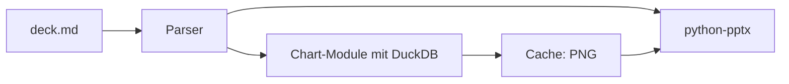

## Was es macht

Folienschmiede baut aus einer Markdown-Datei und Tabellendaten (CSV, Parquet,
Excel) ein PowerPoint-Deck. Inhalt, Platzierung und Charts liegen als
versionierbarer Text vor, nicht in einer `.pptx`, die man von Hand nachzieht.
Das passt für Decks, deren Zahlen sich ändern: Wer eine Zahl ändern will,
ändert die Daten und baut neu.

## Wie es funktioniert

- Ein einzelnes Python-Skript (`foliant.py`) mit PEP-723-Abhängigkeiten. Außer
  `uv` ist nichts zu installieren. Kern sind python-pptx, matplotlib, DuckDB und
  markdown-it-py.
- Folien trennt `---`. Blöcke stehen zwischen `:::` und tragen eine Position:
  im Raster (`area=[x,y,w,h]`), in Zentimetern oder als Placeholder eines
  Templates.
- Ein Chart ist ein Python-Modul mit `build(ctx, **params)`, das eine
  Matplotlib-Figure liefert. Über `ctx.sql` joint es mehrere Datendateien per
  DuckDB, ohne pandas-Merge-Ketten.
- Ein Cache rendert einen Chart nur neu, wenn sich Quelltext, Parameter, Theme
  oder eine gelesene Datendatei geändert haben. Ein Rebuild ohne Änderungen
  dauert Bruchteile einer Sekunde.
- Tabellen entstehen als native PowerPoint-Tabellen und bleiben editierbar.

```bash
uv run foliant.py build deck.md
```

Daneben gibt es `charts` (nur die Bilder rendern), `check` (validieren ohne
Ausgabe) und `clean` (Cache leeren).



## Stand

Entstanden an einem Tag: sieben Commits am 2026-08-20, Version 0.1 nach einer
eigenen Spezifikation. 90 Tests laufen grün. Zwei Beispieldecks mit
synthetischen Daten dienen als Referenz. Es fehlen Watch-Modus und
Live-Vorschau. Charts sind Bilder statt nativer Diagramme, und Änderungen in der
`.pptx` fließen nicht ins Markdown zurück.
