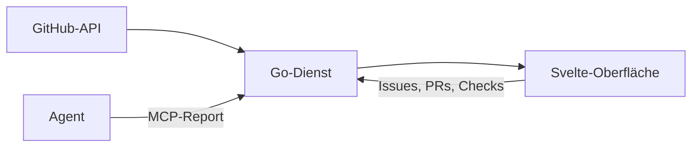

## Was es macht

go-knowledge-planner ist eine Arbeitsansicht über viele Repos: offene
GitHub-Issues, laufende OpenSpec-Changes, Pull Requests und CI-Läufe in einer
Oberfläche. Sie zeigt, was als Nächstes dran ist, was blockiert ist und welche
Belege (Screenshots, Testausgaben) ein Agent zu einer Aufgabe eingereicht hat.
Gedacht ist sie für einen Ablauf, in dem Coding-Agenten Changes abarbeiten und
ein Mensch den Stand prüft.

## Wie es funktioniert

- Ein Go-Dienst ohne externe Go-Abhängigkeiten. Die Svelte-Oberfläche liegt als
  fertiges Bundle per `go:embed` im Binary. Betrieb als Docker-Container über
  `just deploy`.
- Die Oberfläche ist an die To-do-App Things angelehnt: links die Repos nach
  Bereichen, in der Mitte die offenen Issues in Abarbeitungsfolge über
  `blocked_by`, darunter der zugehörige Change mit den Aufgaben aus `tasks.md`.
  Dazu kommen die Ansichten *Heute* und *Logbuch* über alle Repos.
- Die Daten kommen direkt über die REST- und GraphQL-API von GitHub, mit
  ETag-Abrufen, Antwort aus dem Speicher und Erneuerung im Hintergrund.
- Aus der Oberfläche heraus lassen sich Issues anlegen und schließen, Blocker
  setzen, Reviews beantworten, PRs mergen und fehlgeschlagene Checks neu starten.
- Ein MCP-Endpunkt nimmt Fortschritts-Reports von Agenten an und legt sie
  append-only als Belege ab.

## Stand

Erster Commit am 2026-06-06, letzter am 2026-10-01, insgesamt 318 Commits.
Begonnen hat das Projekt als Go-Port einer früheren Deno-App und als Ansicht für
beads-Maps. Seit dem 2026-09-24 läuft das Repo selbst im OpenSpec-Ablauf: beads
ist als Tracker stillgelegt, jede Änderung ist ein Change mit eigenem Issue,
Branch und PR, gehalten von maschinellen Gates. 50 Changes sind archiviert,
22 Capabilities beschrieben, dazu gut 1.000 Go-Testfunktionen. Der Code, der
beads-Daten liest, bleibt als eine von mehreren Aufgabenquellen erhalten.
