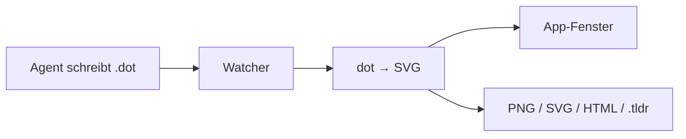

## Was es macht

Graphviz Preview ist eine macOS-App, die `.dot`-Dateien live anzeigt. Ein
Coding-Agent schreibt nur die Graph-Beschreibung, Layout und Rendering übernimmt
Graphviz. Damit entfällt das Platzieren von Formen von Hand, das ein
Agent bei Zeichen-Tools wie tldraw selbst ausrechnen muss.

## Wie es funktioniert

- **Stack:** Tauri v2 mit Rust-Backend und React-19-Frontend (Vite), ohne
  UI-Framework.
- **Rendering:** Das Backend ruft das systemweite `dot` auf und gibt SVG an die
  Oberfläche.
- **Live-Ansicht:** Ein Datei-Watcher (`notify`) rendert neu, sobald der Agent
  die Datei speichert.
- **Export:** PNG, SVG und HTML neben der Quelldatei, dazu ein `.tldr`-Export,
  der Knoten, Kanten und Cluster in tldraw-Formen übersetzt.
- **Bedienung:** Sidebar mit zuletzt geöffneten Dateien, Drop-Zone,
  Dateizuordnung für `.dot`.



```bash
brew install graphviz
just dev
```

## Stand

Entwickelt vom 2026-08-08 bis 2026-08-16 in zehn Commits, aktuell Version
0.1.10. Fünf Rust-Tests und ein Vitest-Test laufen mit. Offen ist der
tldraw-Export: HTML-Labels werden dort noch nicht sauber dargestellt. Ein
GitHub-Workflow baut zusätzlich einen Windows-Installer.
