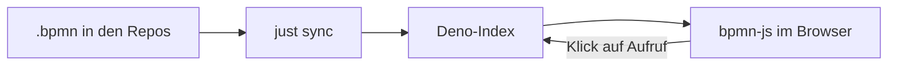

## Was es macht

Prozess-Atlas zeigt BPMN-Diagramme im Browser und verbindet sie: Ein Klick auf
eine Aufruf-Aktivität öffnet den Teilprozess, den sie aufruft. So wird aus
vielen einzelnen `.bpmn`-Dateien eine durchklickbare Karte meiner Abläufe. Die
Diagramme selbst liegen in den jeweiligen Repos, der Atlas sammelt und zeigt
sie.

## Wie es funktioniert

- **Server:** Deno indiziert alle Dateien unter `diagrams/` und liefert sie aus.
  Die API ist nach Prozess-ID adressiert, nicht nach Dateiname – nur so findet
  eine `callActivity` ihren Teilprozess auch in einer anderen Datei.
- **Frontend:** bpmn-js zeichnet, Vite baut das Bundle. Der Editor wird nur im
  Edit-Mode nachgeladen, ein reiner Lese-Aufruf bleibt schlank.
- **Sync:** `just sync` holt die Diagramme aus den Repos in `sources.yml`,
  setzt das Layout und platziert Notizen, die das Auto-Layout auslässt.
- **Einstiege:** Ein Prozess, den niemand aufruft, ist ein Einstieg. Fehlende
  Ziele zeichnet der Atlas rot gestrichelt.
- **Edit-Mode:** Läuft nur lokal und schreibt direkt in den Arbeitsbaum, damit
  jede Änderung als Commit landet. Neue Prozesse starten als Platzhalter, den
  der Modeler oder ein Agent füllt.

```bash
just sync && just build && just serve
```



## Stand

Alle drei Commits stammen vom 2026-08-30. Der Atlas läuft als Container nur im
privaten Netz, weil die Diagramme zusammen eine Karte privater Infrastruktur
ergeben. 25 Deno-Tests decken Index, BPMN-Erzeugung und API ab.

## Vorgänger

Davor gab es einen LikeC4-Versuch und archgraph, einen eigenen Nachbau von
Ilograph: YAML rein, Layout mit elkjs, SVG in einer einzelnen HTML-Datei.
archgraph kam über die Pre-Alpha nicht hinaus, weil Layout und Animationen des
Vorbilds viele Nachbesserungsrunden kosteten. Prozess-Atlas setzt stattdessen
auf den Standard BPMN und die fertige Bibliothek bpmn-js. Eigener Code bleibt
nur für Index, Drill-down und Sync.
