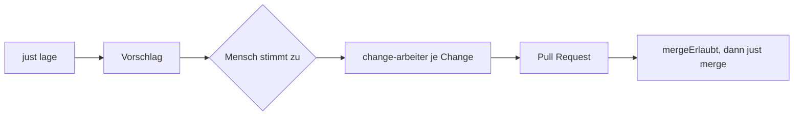

## Was es macht

Der Leitstand ist ein Skill für Claude Code, der die offenen OpenSpec-Changes im
ops-lab-Ablauf führt. Er erhebt die Lage, schlägt vor, welche Changes ohne Konflikt
parallel laufen können, und beauftragt nach Zustimmung je Change einen eigenen Agenten. Am
Ende entscheidet er über den Merge. So muss bei mehreren startbaren Changes niemand
dieselbe Kette mehrfach von Hand anstoßen.

## Wie es funktioniert

- `just lage` liefert ein JSON: zuletzt abgeschlossen, aktiv, frei, blockiert, verwaiste
  Arbeitsräume, offene Issues.
- `auftraege()` wählt aus den freien Changes die aus, deren berührte Dateien sich nicht
  überschneiden. Beauftragt wird erst, wenn der Mensch zustimmt.
- Je Change startet ein Subagent `change-arbeiter` in seinem eigenen Worktree. Er läuft die
  Kette von `just neu` bis `just pr`. Mergen und weitere Agenten starten darf er nicht.
- `mergeErlaubt()` gibt den Merge nur frei, wenn `gate1.md`, `gate2.md`, `fertig.md` und
  ein Bildbeleg vorliegen und die Prüfungen des Pull Requests grün sind. Ein unbekannter
  Zustand gilt als nicht grün.
- Abhängigkeiten stehen als `blocked_by` am GitHub-Issue, nicht im Verlauf.

Die Grundidee: Prosa in einem Skill lässt sich nicht prüfen. Die beiden teuren
Entscheidungen – wer gleichzeitig laufen darf und ob gemergt wird – stehen deshalb als
reine Funktionen mit Test in `tools/leitstand.mjs`. Der Skill ruft sie nur auf.

## Stand

Seit dem 20. September 2026 Teil des ops-lab, zuletzt geändert am 28. September 2026
(vier Commits an Skill, Agent und Entscheidungsfunktionen, 20 Tests). Ein Installer legt
Skill und Arbeiter global in Claude Code ab. Die Grenze: Der Leitstand lebt in der
laufenden Sitzung. Wird sie geschlossen, sind die Arbeiter weg – für Läufe über Nacht ist
er nicht gebaut.
