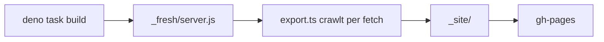

## Was es macht

Diese Seite. Sie bündelt Blogposts, ein Verzeichnis eigener und externer Tools,
die Quellen, denen ich folge, und ein Lab mit kleinen Werkzeugen im Browser.
Ausgeliefert wird reines HTML über GitHub Pages – in Produktion läuft kein
Server.

## Wie es funktioniert

Gebaut ist die Seite mit Deno Fresh 2 (Vite 7, Preact 10, Tailwind CSS 4).
Posts liegen als Markdown in `content/posts/`, Tools, Quellen und iOS-Apps in
JSON-Dateien, die Detailtexte der eigenen Tools in `content/projekte/`. Interaktiv sind nur einzelne Islands: Startseite, JSON Formatter,
Regex Tester und Mermaid-Diagramme.

- `scripts/export.ts` lädt den gebauten Fresh-Server im selben Prozess, crawlt
  ihn per `fetch()` ab `/` und schreibt jede Antwort nach `_site/`.
- Der Export prüft mit: Er bricht ab, wenn ein interner Link nicht mit 200
  antwortet, eine Alt-URL fehlt oder eine Datei aus `static/` nicht
  byte-identisch ankommt.
- Beim Build lädt `lib/feeds.ts` von jeder Quelle den neuesten Eintrag. Ein
  Feed, der nicht antwortet, erzeugt nur eine Warnung.
- Eine GitHub Action prüft Pull Requests und deployt `main` in den Branch
  `gh-pages` – zusätzlich einmal täglich, damit die Quellen aktuell bleiben.

```sh
deno task site    # build + export → _site/
```



## Stand

Die Fresh-Fassung entstand am 2. Oktober 2026 in einem Schritt und ersetzte
die Jekyll-Seite; seitdem kamen das neue Design, das Tool-Verzeichnis und die
Quellen dazu. Alle alten URLs funktionieren weiter: `scripts/legacy-urls.txt`
listet sie, der Export prüft sie bei jedem Build. Neben `deno task check`
(Format, Lint, Typprüfung) prüft `deno task test` die Tool-Daten: keine iOS-App
im Verzeichnis, zu jedem eigenen Tool genau ein Detailtext.
